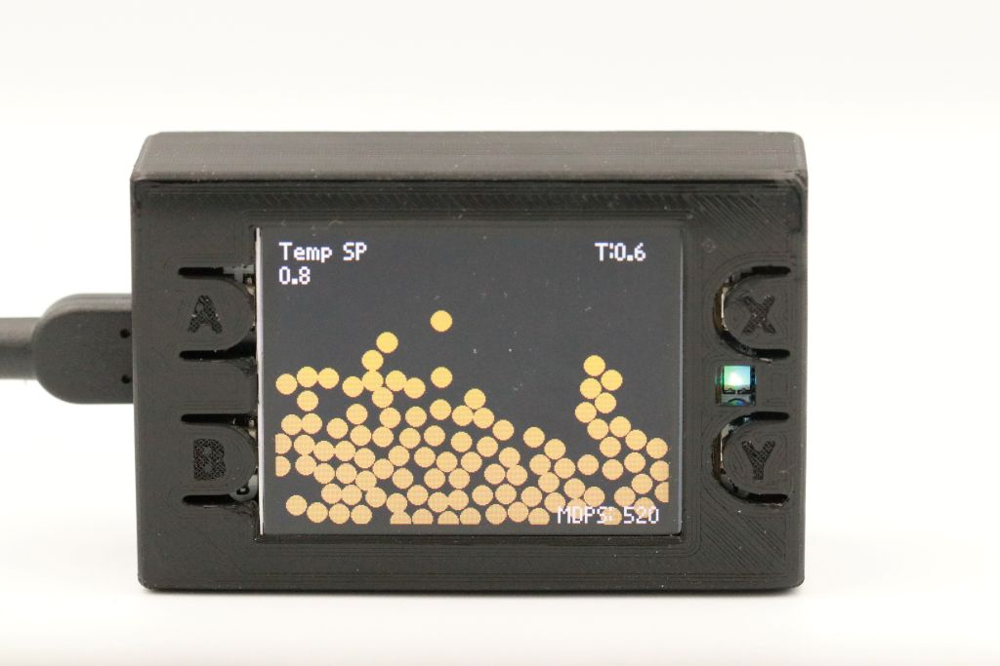
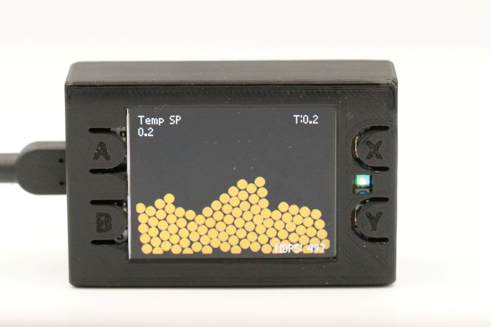
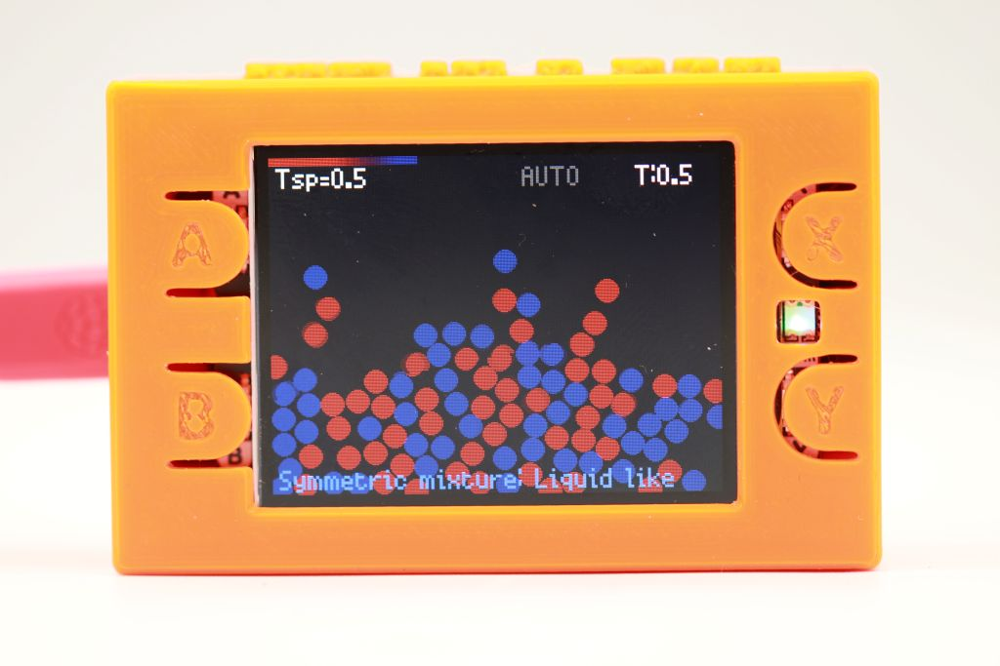
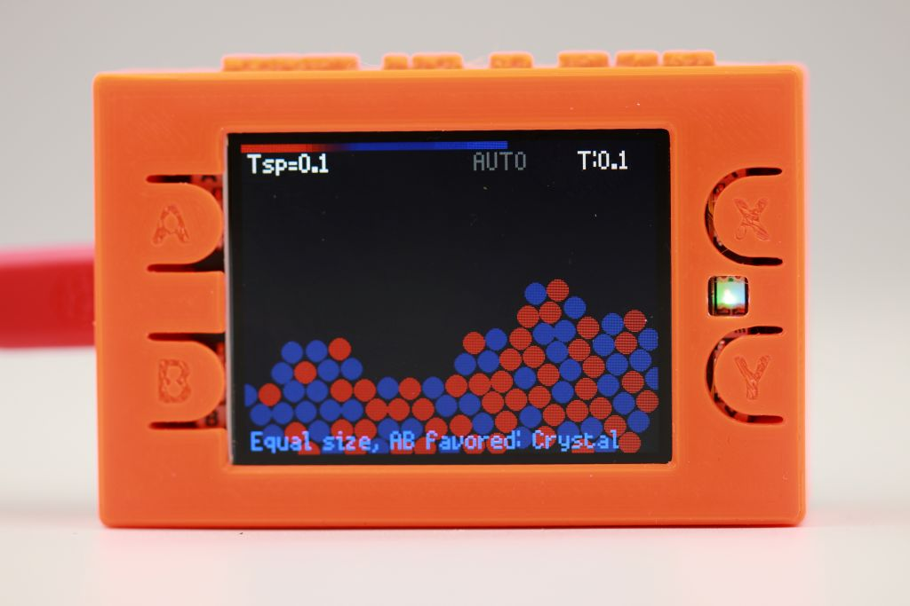
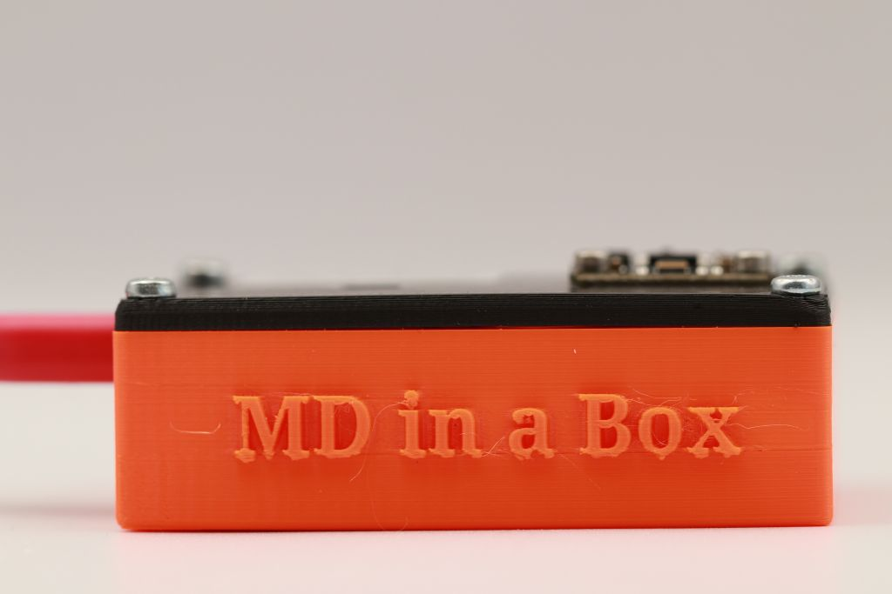
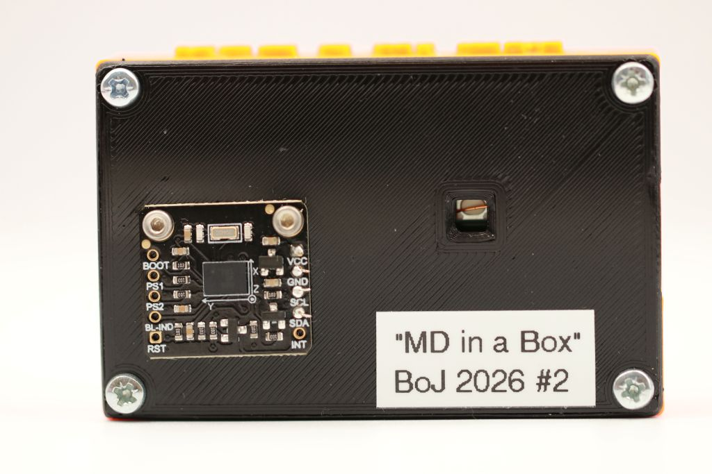

# MD in a Box

Interactive 2D **binary** molecular dynamics simulation running on a
Raspberry Pi Pico 2 with a colour display.
Designed as a demonstration device for the RUC Physics Department — shows
gas, liquid, and crystal phases; phase separation; and size-mismatch effects,
all in real time on a handheld device.

Based on the browser-based MD simulation by Ulf R. Pedersen: https://urp.dk/md/

| | |
|:---:|:---:|
| <video width="400" autoplay loop muted controls> <source src="assets/interacting.mp4" type="video/mp4"> Your browser does not support the video tag. </video> | <video width="400" autoplay loop muted controls> <source src="assets/melting.mp4" type="video/mp4"> Your browser does not support the video tag. </video> |
| <br>*Liquid phase (monoatomic)* | <br>*Crystal phase (monoatomic)* |
| <br>*Binary LJ liquid phase* | <br>*Binary LJ crystal phase* |

| | |
|:---:|:---:|
| <br>*Top view* | <br>*Back view with accelerometer* |


---

## Physics

Two atom types — **A** (red) and **B** (blue) — interact via Lennard-Jones pair
potentials. The relative size and cross-species interaction strength (ε_AB)
are tunable at runtime, enabling:

- **Phase separation** — when ε_AB ≪ 1, A and B segregate into domains
- **AB attraction** — when ε_AB ≫ 1, A and B prefer to stay mixed
- **Size mismatch** — different radii produce interesting structures

| Parameter | Description |
|-----------|-------------|
| σ_AA = 2 × r_A | LJ diameter for A–A pairs |
| σ_BB = 2 × r_B | LJ diameter for B–B pairs |
| σ_AB = r_A + r_B | Lorentz–Berthelot mixing rule |
| ε_AA = ε_BB = 1 | Fixed well depths |
| ε_AB | Tunable A–B well depth |
| Cutoff | 3.5 × r_A |

**Integrator:** Leap Frog
**Thermostat:** Langevin (friction + Gaussian noise)
**Walls:** 1/r⁶ soft repulsion from each boundary, with emergency hard-wall clamp

---

## Hardware

| Component | Details |
|-----------|---------|
| Raspberry Pi Pico 2 | RP2350, dual-core ARM Cortex-M33 @ 150 MHz, 520 KB RAM |
| Pico Display Pack 2.0 | 320×240 pixel display (Pimoroni) |
| BNO055 9-axis IMU | Gravity vector + linear acceleration (optional) |

Total hardware cost: ~€65

---

## Architecture

Both CPU cores run in parallel:

- **Core 0** — Display rendering (PicoGraphics, ~30 FPS) and button input
- **Core 1** — Physics loop, running C-accelerated MD steps continuously

Inter-core communication uses module-level shared globals (positions, temperatures,
parameter requests). The BNO055 accelerometer feeds device tilt (gravity
direction) and movement (box frame velocity) into the physics on Core 1.

---

## Performance

The physics loop (LJ forces + Leap Frog + Langevin thermostat) is implemented
as a custom C extension to ulab (`user.c`). A unified simulation class
(`md_sim.py`) auto-detects the available backend at startup:

| Backend | Runs on | Description |
|---------|---------|-------------|
| `ulab_c` | Pico + C build | C extension — fastest |
| `ulab` | Pico, any build | Pure Python with ulab arrays |
| `cpython` | Desktop | NumPy — for testing |

Performance measured on Pico 2, no display (MD steps/second):

| N atoms | ulab (MDPS) | ulab + C (MDPS) | Speedup |
|---------|------------|-----------------|---------|
| 16      | 78         | 12,674          | ~160×   |
| 25      | 35         | 6,816           | ~195×   |
| 36      | 18         | 3,960           | ~220×   |
| 64      | 5          | 1,553           | ~310×   |
| 100     | —          | 748             | —       |

In the full demo (display + accelerometer + 100 atoms): ~500 MD steps/second.

---

## Demo Mode

The device starts in **Demo mode**, which autonomously cycles through 8
scripted scenarios. Each scenario runs the same temperature protocol:

> Hot gas → Cooling → Liquid-like → Cooling → Crystal → Hard quench → Crystal → Melting

| # | Title | Key parameter |
|---|-------|--------------|
| 1 | Monoatomic system | r_NB = 0 (pure A) |
| 2 | Symmetric mixture | ε_AB = 1.0 (A and B behave identically) |
| 3 | Same size, AB disfavored | ε_AB = 0.1 → phase separation |
| 4 | Same size, AB favored | ε_AB = 2.0 → AB attraction |
| 5 | Different size, AB disfavored | r_B = 1.5×r_A, ε_AB = 0.5 |
| 6 | Different size, AB favored | r_B = 1.5×r_A, ε_AB = 2.0 |
| 7 | Few large, AB favored | 10 % large B, ε_AB = 2.0 |
| 8 | Few small, AB favored | 10 % small B, ε_AB = 2.0 |

### Demo button controls

| Button | Action |
|--------|--------|
| A | Cycle info overlay: temperature setpoint / LJ parameters / gravity |
| X | Skip forward to next scenario (fresh simulation) |
| Y | Skip backward to previous scenario (fresh simulation) |
| B press | Switch to Manual mode (keeps current simulation state) |
| A + B | Shutdown |

---

## Manual Mode

Press **B** in Demo mode to enter **Manual mode** and take full control.
The simulation continues from the current state; the temperature ramp is paused.

### Manual button controls

| Button | Action |
|--------|--------|
| A | Cycle selected parameter |
| X | Increase selected parameter |
| Y | Decrease selected parameter (at T=0: first press arms quench; second press within 2 s zeroes all velocities) |
| B release | Return to Demo mode (T-ramp resumes, LJ params kept) |
| A + B | Shutdown |

### Adjustable parameters (basic mode — first 3)

| Parameter | Description |
|-----------|-------------|
| Temp SP | Thermostat target temperature |
| Gravity | Downward gravity magnitude |
| Pause | Freeze / resume physics |

Set `EXPERT_MODE = True` in `run_show_sim_pico.py` to expose all 7 parameters
(adds: Coupling · r_NB · r_sizeB · ε_AB).

### Accelerometer (if connected)

- **Tilt** the device → gravity direction follows orientation
- **Shake** it → box frame moves, transferring momentum to particles (heating)

---

## Files

### Core simulation

| File | Description |
|------|-------------|
| `md_sim.py` | Unified `MDSimulation` class — auto-selects backend (`ulab_c` / `ulab` / `cpython`) |
| `user.c` | Custom ulab C extension: full physics loop (LJ forces + Leap Frog + Langevin) |
| `bno055_handler.py` | BNO055 accelerometer wrapper with axis remapping |

### Applications

| File | Runs on | Description |
|------|---------|-------------|
| `run_show_sim_pico.py` | Pico | **Main application** — Demo + Manual modes, dual-core, display |
| `run_show_sim_numpy_pc.py` | Desktop | Desktop test with optional live matplotlib plot |

### Benchmarks

| File | Runs on | Description |
|------|---------|-------------|
| `run_test_all.py` | Pico / Desktop | Text benchmark for all backends |
| `run_test_pico_display.py` | Pico | Visual benchmark with display output, button-paced |

### Documentation

| File | Description |
|------|-------------|
| [MD in a Box — User Guide](assets/md_in_a_box_user_guide.pdf) | Full user guide (PDF) |

---

## Quick Start

### Desktop test

```bash
python3 run_show_sim_numpy_pc.py
```

### Upload and run on Pico

```bash
# Copy files to Pico
mpremote fs cp md_sim.py :
mpremote fs cp bno055_handler.py :
mpremote fs cp run_show_sim_pico.py :

# Run main demo
mpremote run run_show_sim_pico.py

# Run benchmark (no display needed)
mpremote run run_test_all.py
```

---

## Building the Firmware

The C extension requires a custom MicroPython + ulab build. Place `user.c` in:

```
ulab/code/user/user.c
```

and enable it by setting `ULAB_HAS_USER_MODULE` in `ulab.h`.

For full Pico Display 2.0 support, build against the Pimoroni CI environment:

```
https://github.com/pimoroni/pimoroni-pico-rp2350
```

The script `setup_and_build_firmware.sh` automates this (tested February 2026;
may need updating if the Pimoroni CI changes).

### BNO055 accelerometer support

Copy `bno055.py` and `bno055_base.py` from the MicroPython IMU library to the
device:

```
https://github.com/micropython-IMU/micropython-bno055
```

The simulation runs fine without the accelerometer — gravity defaults to a
fixed downward value.

---

## References

- Ulf R. Pedersen's browser MD simulation: https://urp.dk/md/
- ulab (numpy for MicroPython): https://github.com/v923z/micropython-ulab
- Pimoroni Pico libraries: https://github.com/pimoroni/pimoroni-pico
- MicroPython-bno055: https://github.com/micropython-IMU/micropython-bno055
- ``Pimoroni Display Pack 2 Case'' by JeffCurless: https://www.printables.com/model/920520-pimoroni-display-pack-2-case

---

## License

MIT — see `LICENSE`.

## Authors

Bo Jakobsen, IMFUFA, Roskilde University (boj@ruc.dk)  
Based on the browser-based MD simulation by Ulf R. Pedersen (urp@ruc.dk)
